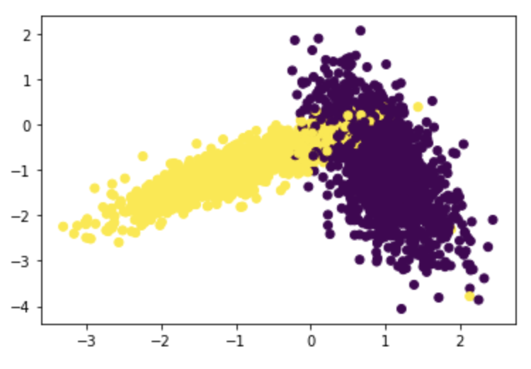

<h1 align="center">Custom implementation of RandomSearchCV</h1>

## Intro to Cross Validation

Cross Validation in Machine Learning is a technique used to assess how well a trained model does on the test data. Basically, we can train our model(s) with different hyperparameters and test each of them on the test/cross validation data to find out the most suitable set of hyperparameters.

## Implementation

Here we implement random search cross validation (Similar to sklearn's RandomizedSearchCV) using KNearestNeighbours classifier. The hyperparameter will therefore be k, the number of neighbours of a point in knn. The randomness comes from choosing values of k randomly from a set range. In contrast to GridSearchCV, not all parameter values are tried out, but rather a fixed number of parameter settings (in our case 10) is sampled from the specified distributions. The number of folds is used to split the dataset into k groups (k-folds). One group will be used for cross validation while the remaining groups will be used for training the model. This is done in a way that each group becomes the cross validation data for the model once. This process is repeated for each random value of k hence giving us proper accuracies which we can then use to find the best hyperparameter.

## Example

Say we have data as shown below 

 

We set the range for k in knn as 1 to 50 and try 3 folds. The function takes the data and splits it into 3 folds. After selecting 10 random values of k within the range, we train the model on two groups and cross validate on the other repeating this so each group is used as cross validation data. This is done for each value of k. Here we can see that the model accuracy improves gradually for each value of k and the classifier does a fairly decent job in separating the points. 

 
